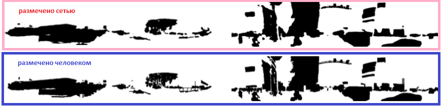

## ТЗ 

по задаче., необходимо изучить методы сборки нейросети из предоставленного репозитория
имеются две ссылки на git
1) https://github.com/Herrccc/DR-TANet (требуется сборка под CUDA)  
2) https://github.com/kensakurada/sscdnet(можно собрать решение без CUDA, на процессоре)

Задача: Определение изменения в зоне анализа камеры базового изображения

Этапы исследования:
- научиться обучать модель на основе ДатаСета Цунами
- на выход результата у нас должно получиться следующие.
подается картинка фона, картинка изменения фона и маски результатов.

------------------------

## Результаты.

В силу ограничений по "железу" была обучена модель в конфигурации:    
    &nbsp;&nbsp;&nbsp;&nbsp;&nbsp;&nbsp;базовая сеть: __resnet18__  
    &nbsp;&nbsp;&nbsp;&nbsp;&nbsp;&nbsp;конфигурация блока трансформеров: __DRTAM__  
    &nbsp;&nbsp;&nbsp;&nbsp;&nbsp;&nbsp;использование механизма: __CHVA__ включено  

  

  

  

  

  

  

  

  

  

  

В своей работе (https://arxiv.org/pdf/2103.00879.pdf) ввторы утверждают что можго добиться и лучшего результата.

---------------------------------

## Описание сети.

Данная модель представляет из себя нечто в виде гибрида сети __U-net__ и технологии __Transformers__. У сети два входа. На каждый вход подается свое изображение. Каждое изображение попадает в энкодер на базе __resnet__ (возможны варианты __resnet18, resnet34, resnet50__). Каждый энкодер с четырех уровней прохождения сигнала выдает значения сигнала в блок последовательных трансформеров которые в конце выдают результирующий сигнал в декодер. Декодер простой каскад апсемпл-слоев (все как в __U-net__). В самих трансформерах можно применять две схемы разбиения информации на "слова". Или для всех уровней задать один и тот же размер "слова" - __TAM__ (например в один "пиксель") или динамически менять это значение - __DRTAM__. Кроме всего прочего на выходе можно ещё применить механизм __CHVA__ (для лучшего обнаружения вертикальных и горизонтальных предметов).

__Что было сделано.__

На основе https://github.com/Herrccc/DR-TANet была адаптирована под __windows10__ собрана и обучена сеть.

Для запуска обучения можно просто запустить файл __train.py__ (параметры можно задавать в командной строке - как в оригинале или в самом файле). Файл весов модели будет в папке __check__.
Для запуска теста нужно запустить __eval.py__ (важно чтобы параметры сети при сборке соответствовали параметрам при обучении). Результаты тестирования будут лежать в __test_results__.

Для предсказания результата для файлов не из набора __TSUNAMI__ надо поместить исходные файлы в папку __files_to_predict__ и запустить файл __to_pred_files.py__ и затем забрать результаты из папки __predicted__.

Важно отслеживать чтобы параметры пред обученной сети были правильно указаны в файлах __eval.py__ и __to_pred_files.py__.

__P.S.__ Обучить модель так, чтоб получить значения качества которые они указали в своей работе https://arxiv.org/pdf/2103.00879.pdf не получилось. При размере памяти на __GPU__ в __8__ Гигабайт сеть на основе __resnet50__ и __batch = 3__ уже не взлетает... 